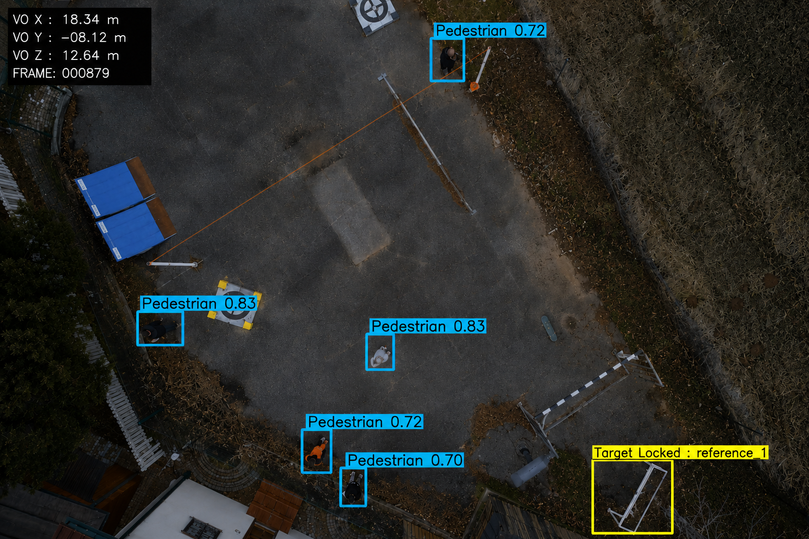
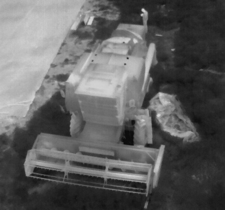
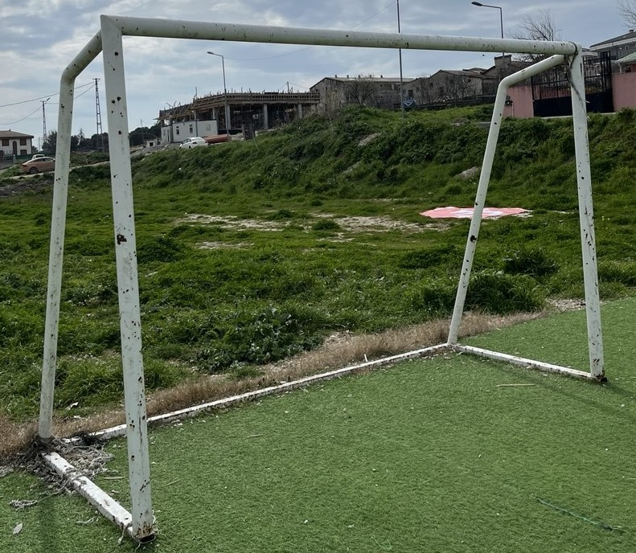
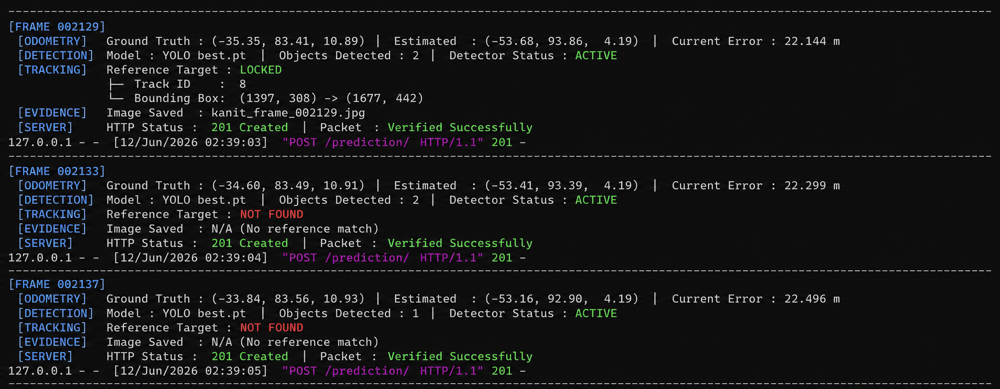
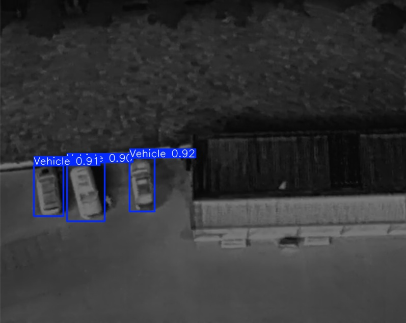

# Autonomous UAV Edge Navigation and Tracking

An air-gapped decision support system designed for autonomous UAV navigation and target tracking in GPS-denied environments. This repository integrates real-time object detection, cross-modal patch-similarity locking, and state estimation running fully offline on localized edge nodes.

---

## System Architecture and Multi-Task Pipeline

The platform operates on a concurrent pipeline optimized for real-time inference on edge hardware, utilizing camera intrinsic calibration matrices to transform and align spatial coordinates.

### Task 1: Object Detection and Kinematics Extraction (YOLOv8)
*   Dynamic Localization: Evaluates objects using localized deep networks to assess structural properties and semantic positioning.
*   Status Indicators: Outputs structural classification alongside distinct diagnostic flags:
    *   `landing_status`: Evaluates structural zone safety metrics (-1, 0, 1) to determine landing feasibility.
    *   `moving_status`: Determines target state kinematics (0: Stationary, 1: Moving).

### Task 2: GPS-Denied State Estimation (Bayesian Visual Odometry)
*   Alternative Navigation: Relies exclusively on low-altitude downward-facing camera arrays to maintain odometry metrics when global satellite positioning links sever.
*   Drift Mitigation: Integrates a localized 1D Linear Kalman Filter (`BayesianScaleFilter`) alongside Lucas-Kanade Optical Flow to filter out high-frequency noise and sensor variance from position calculation models.
*   High-Dynamic Robustness: Built to withstand anomalies, drift, and rapid rotational banking maneuvers during critical flight phases.

### Task 3: Cross-Modal and Cross-Perspective Zero-Shot Target Locking (DINOv2)
*   Zero-Shot Re-Identification: Locks onto targets using arbitrary, non-cooperative, and completely untrained reference patches.
*   Cross-Modal Alignment: Matches distinct sensor profiles, such as matching a Thermal (IR) input reference patch to a live RGB aerial stream.
*   Cross-Perspective Generalization: Maps features between low-angle ground viewpoints (e.g., ground-level targets) and high-altitude bird's-eye views.

---

## Live Telemetry Data Structure

During standard runtime execution, the system aggregates tracking metadata and state transforms into structured JSON payloads. Below is an operational log snippet from a synchronized three-task tracking execution synchronized with the evaluation API:

```json
{
  "frame_000272.jpg": {
    "frame": "[http://uav-evaluation-server.local/media/test_video/frame_000272.jpg](http://uav-evaluation-server.local/media/test_video/frame_000272.jpg)",
    "detected_objects": [
      {
        "cls": "[http://uav-evaluation-server.local/classes/1/](http://uav-evaluation-server.local/classes/1/)",
        "landing_status": "-1",
        "moving_status": "1",
        "top_left_x": "926.8118286132812",
        "top_left_y": "641.091796875",
        "bottom_right_x": "1052.2401123046875",
        "bottom_right_y": "773.009521484375"
      },
      {
        "cls": "[http://uav-evaluation-server.local/classes/1/](http://uav-evaluation-server.local/classes/1/)",
        "landing_status": "-1",
        "moving_status": "0",
        "top_left_x": "283.61846923828125",
        "top_left_y": "606.632568359375",
        "bottom_right_x": "369.40594482421875",
        "bottom_right_y": "741.3778076171875"
      },
      {
        "cls": "[http://uav-evaluation-server.local/classes/2/](http://uav-evaluation-server.local/classes/2/)",
        "landing_status": "-1",
        "moving_status": "1",
        "top_left_x": "996.187744140625",
        "top_left_y": "660.1854248046875",
        "bottom_right_x": "1013.9011840820312",
        "bottom_right_y": "680.6777954101562"
      }
    ],
    "detected_translations": [
      {
        "translation_x": -25.641985107686786,
        "translation_y": 78.81668618848228,
        "translation_z": 0.4252734114385854
      }
    ],
    "reference_predictions": [
      {
        "reference": "[http://uav-evaluation-server.local/media/reference/reference3.JPG](http://uav-evaluation-server.local/media/reference/reference3.JPG)",
        "frame": "[http://uav-evaluation-server.local/media/test_video/frame_000272.jpg](http://uav-evaluation-server.local/media/test_video/frame_000272.jpg)",
        "top_left_x": "1235.0",
        "top_left_y": "230.0",
        "bottom_right_x": "1440.0",
        "bottom_right_y": "360.0"
      },
      {
        "reference": "[http://uav-evaluation-server.local/media/reference/reference1.JPG](http://uav-evaluation-server.local/media/reference/reference1.JPG)",
        "frame": "[http://uav-evaluation-server.local/media/test_video/frame_000272.jpg](http://uav-evaluation-server.local/media/test_video/frame_000272.jpg)",
        "top_left_x": "1373.0",
        "top_left_y": "516.0",
        "bottom_right_x": "1739.0",
        "bottom_right_y": "748.0"
      }
    ]
  }
}
```

---

## Inference and Verification Visuals

Below are the live execution proofs, cross-perspective matching evaluations, and localization performance metrics collected from active flight simulations:

### 1. Unified Multi-Task Aerial Inference (aerial_inference.png)
Real-time edge deployment demonstrating simultaneous YOLOv8 kinematics localization, DINOv2 target locking (`[TARGET LOCKED]`), and active Bayesian Visual Odometry vector tracking arrays (VO_X, VO_Y, VO_Z).



#### DINOv2 Cross-Modal Baseline Targets
These ground-truth patches serve as the verification matrix for the zero-shot re-identification engine. The pipeline processes these source descriptors to lock onto the corresponding targets inside the aerial frame above.

| Thermal Reference Object | RGB Reference Object |
| :---: | :---: |
|  |  |

---

### 2. Comprehensive Multi-Task Pipeline and Low-Altitude Log Verification (task2_telemetry_log.png)
A unified terminal execution log validating the synchronized deployment of all three core tasks under low-altitude operational constraints (Z ≈ 10.89m). The telemetry explicitly verifies active YOLOv8 inferences, DINOv2 locking states (`Reference Target : LOCKED`), and localized coordinate transformations.



---

### 3. Task 1: Multi-Spectral Thermal Inference (thermal_detection.jpg)
Edge deployment verifying YOLOv8 capabilities under strict multi-spectral parameters, performing accurate localization and dynamic object segmentation directly on incoming Infrared (IR) streams.



---

## Installation and Setup

### Prerequisites
*   Python 3.10+
*   Anaconda / Miniconda
*   NVIDIA GPU + CUDA Toolkit (Recommended for Edge Hardware Acceleration)

### 1. Clone the Repository
```bash
git clone [https://github.com/emrealtindag/autonomous-uav-edge-navigation-tracking.git](https://github.com/emrealtindag/autonomous-uav-edge-navigation-tracking.git)
cd autonomous-uav-edge-navigation-tracking
```

### 2. Environment Configuration
Create an isolated virtual environment and install dependencies:
```bash
conda create -n uav-edge python=3.10 -y
conda activate uav-edge
pip install -r requirements.txt
```

### 3. Deploy Model Weights
The pipeline requires localized pre-trained weights to maintain its air-gapped configuration:
1.  Create a `weights` directory in the project root folder.
2.  Place your trained YOLOv8 model file (`best.pt`) directly into the `weights/` directory.

> Note on DINOv2 Deployment: The system architecture is configured for automated weights check. On the very first execution, if local DINOv2 base layers are missing, the pipeline will securely fetch and deploy the weights to the local storage for permanent offline usage.

### 4. Camera Calibration Parameters (Crucial Setup)
Before executing the pipeline, you must check and adapt the camera intrinsic matrices matching your specific sensor hardware or simulator stream configurations. The pixel-to-meter translation logic in Task 2 (Visual Odometry) and the drift thresholds in Task 1 directly depend on these parameters.

Open `src/object_detection_model.py` and calibrate the following fields based on your sensor specification values:
*   `self.K_rgb_4k`: Intrinsic matrix configuration for high-resolution RGB streams (e.g., 3000x4000).
*   `self.K_rgb_1080p`: Intrinsic matrix configuration for standard 1080p RGB input.
*   `self.K_termal`: Intrinsic matrix configuration for thermal infrared inputs (e.g., 512x640).

### 5. Configure Environment Variables
Create a `.env` file in the root directory and securely populate your local credentials. Do not commit this file to the public repository.
```env
AZURE_IOT_CONNECTION_STRING="HostName=<your_hub_name>.azure-devices.net;DeviceId=<your_device_id>;SharedAccessKey=<your_key>"
```

### 6. Execution Pipeline
Ensure your local environment is active before initializing the core tracking loops:
```bash
python main.py
```
```